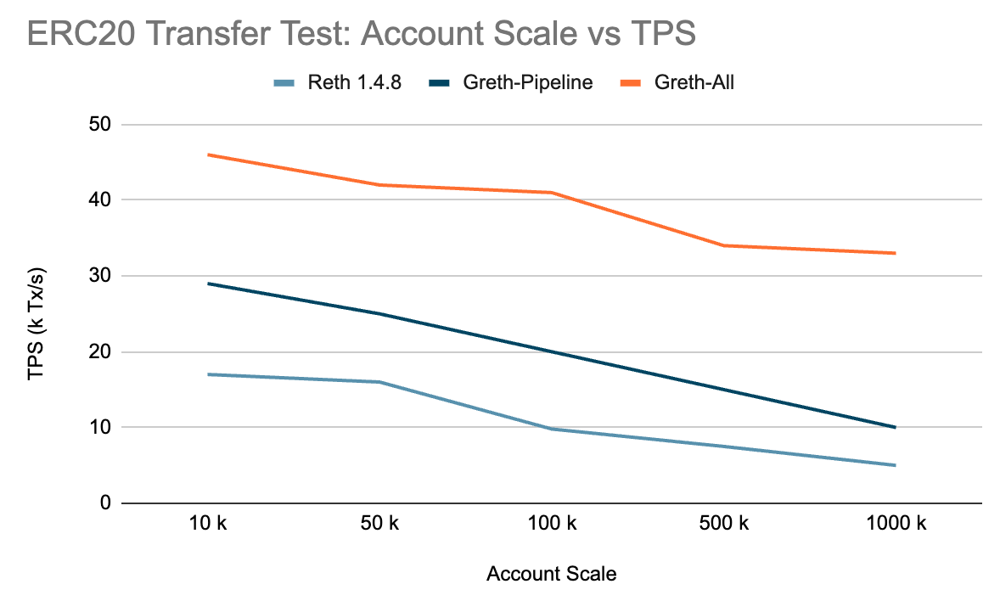
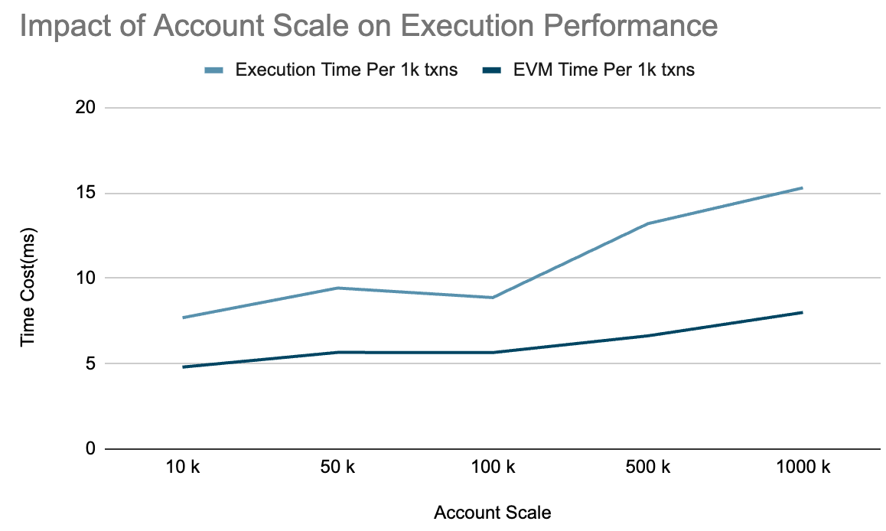

# June 30 Update: Gravity Reth Performance Benchmarks

Gravity reth demonstrates significant performance improvements over vanilla reth through multiple optimizations. Our benchmarks show **2.5-6x+ performance improvement** compared to native Reth 1.4.8, depending on the workload, e.g. the number of accounts and contract complexity.

## Background: Using Reth As The Core Execution Engine

Gravity is a Layer 1 blockchain built upon the AptosBFT consensus (Gravity SDK), with its execution layer derived from a modified version of Reth (Gravity-Reth). The system can operate in two modes:

-   **AptosBFT Mode**: Runs the complete consensus process, intended for production deployment and mainnet operations
-   **Solo Mode**: Bypasses consensus and networking components, designed for development testing and execution performance benchmarking

Under Solo mode operation, we conducted comprehensive performance evaluations of the execution layer, yielding the following critical findings:

## Current State and Bottlenecks of Reth Execution Efficiency

-   Compared to earlier iterations, Reth 1.4.8 demonstrates substantial performance improvements through the elimination of redundant logic, establishing itself as a streamlined and efficient execution client
-   However, processing performance exhibits noticeable degradation as account and transaction volumes scale, particularly during I/O-intensive phases such as Merklization and data persistence
-   The Execution and Merklization phases are highly sensitive to I/O operations, constituting critical factors that determine the performance.

## Core Optimization Strategies and Effects in Gravity-Reth

Based on the above observations, Gravity-Reth incorporates targeted optimizations across multiple components and overall architecture, including:

1. **Memory Pool**: Batch transaction insertion and conflict detection mechanisms. Under high transaction volume, the memory pool, similar as a multi-producer, single consumer queue, becomes the bottleneck of the system. The batch transaction insertion and conflict detection mechanism can significantly reduce the number of IO operations.
2. **Grevm (Gravity revm)**: Using our fastest parallel EVM execution engine, Grevm, to significantly reduce the execution time. For more details, please refer to [Grevm2 Technical Report](https://docs.gravity.xyz/research/grevm2).
3. **Pipeline**: Multi-stage asynchronous execution pipeline, which interleaves the execution and IO phases to address I/O and computational bottlenecks.
4. **Parallel State Root**: (almost) Fully parallel Merklization. More details coming soon. See [This commit](https://github.com/Galxe/gravity-reth/commit/8aa01c593b6ab18559bd58a17c932d97494c37e3) for the current implementation.
5. **Gravity Cache**: State and Trie caching mechanisms to reduce I/O pressure. We implemented a LRU cache for the state and trie, which can significantly reduce the number of IO operations.

## Benchmark Results

### Test Environment

-   **Machine**: GCP c4-highcpu-16
-   **CPU**: 16 vCPUs, 2.3 GHz
-   **Memory**: 32 GB
-   **Disk**: 1 TB SSD, 200 MB/s max bandwidth, 30,000 IOPS

### ERC20 Transfer Performance (100k accounts)

| Version               | TPS     | Block Interval | Block Size    | Execution Time | Merklization | IOPS      |
| --------------------- | ------- | -------------- | ------------- | -------------- | ------------ | --------- |
| Reth 1.4.8            | 9.8k    | 0.66s          | 6.4k txns     | 140ms          | 380ms        | 3k        |
| Greth (Pipeline-only) | 20k     | 0.2s           | 4k txns       | 95ms           | 240ms        | 5.8k      |
| **Greth All**         | **41k** | **0.15s**      | **6.2k txns** | **52ms**       | **34ms**     | **11.1k** |

_Figure 1: ERC20 Transfer Performance Comparison Across Different Account Scales_

**Result**: Gravity reth achieves **1.5 Gigagas/s** throughput, representing a **4x improvement** over vanilla Reth.

### Performance vs Account Scale

Because of our optimizations, the performance of Gravity reth under high account scale is significantly improved compared to Reth 1.4.8.

| Accounts | Reth 1.4.8 | Greth Pipeline | Greth All |
| -------- | ---------- | -------------- | --------- |
| 10k      | 17k TPS    | 29k TPS        | 46k TPS   |
| 50k      | 16k TPS    | 25k TPS        | 42k TPS   |
| 100k     | 9.8k TPS   | 20k TPS        | 41k TPS   |
| 500k     | 7.5k TPS   | 15k TPS        | 34k TPS   |
| 1M       | 5k TPS     | 10k TPS        | 33k TPS   |

_Figure 2: Impact of Account Scale on Execution Performance_

### Contract Complexity Impact (ERC20 vs Uniswap)

| Metric         | ERC20 Transfer      | Uniswap Swap        |
| -------------- | ------------------- | ------------------- |
| TPS            | 41k (1.5 Gigagas/s) | 21k (1.9 Gigagas/s) |
| Block Interval | 6.2k × 6.6 blocks/s | 5.8k × 3.6 blocks/s |
| Execution Time | 52ms                | 135ms               |
| Merklization   | 34ms                | 30ms                |

## Key Findings

-   **Grevm** significantly optimizes the Execution phase, while **Pipeline** reduces block intervals and increases TPS
-   **Merklization** becomes the bottleneck for block finality, which has been substantially reduced in the latest version
-   Performance remains robust even with increasing account scale, demonstrating effective LRU cache design for hot state access
-   Complex contracts (Uniswap) reduce TPS but maintain high Gigagas/s throughput
