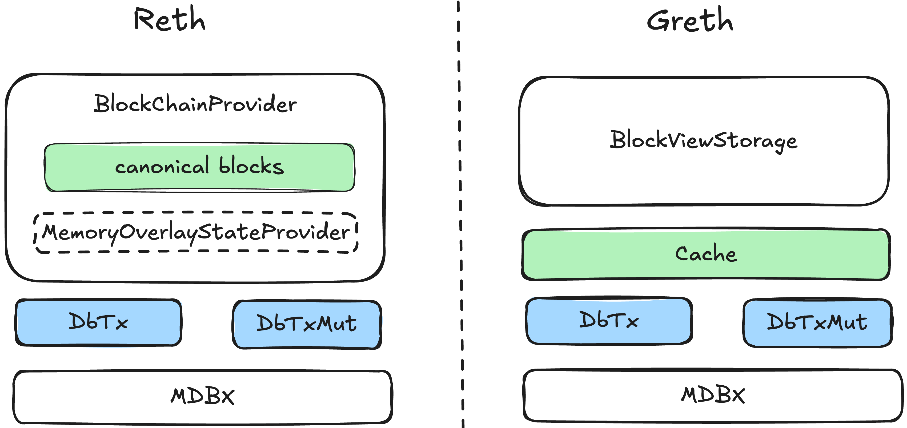

# Gravity Reth: The Fastest Open-Source EVM Execution Client

### Abstract

We introduce Gravity Reth, an open-source, performance-engineered fork of Reth, designed to push the upper bounds of EVM
execution speed. Through a suite of architectural innovations—including Grevm, a DAG-based optimistic parallel EVM; a
**fully parallelized merklization** framework, a **high-performance caching** layer, an **optimized mempool,** and **a
pipelined execution architecture**—Gravity Reth achieves state-of-the-art performance. In a benchmark involving ERC20
transfers across 100,000 accounts, Gravity Reth sustains ~**41,000 transactions per second (TPS)**, equivalent to ~**1.5
Gigagas/s**. This represents a greater than **4x performance boost** over the baseline Reth 1.4.8 client. We present the
design and evaluation of Gravity Reth and our broader goal of contributing these optimizations to the open-source
community to advance the performance of the EVM ecosystem.

## Introduction

For EVM-based ecosystems, the execution client is a critical component of the system stack, often representing a
significant performance bottleneck that limits on-chain throughput and raises transaction costs. While modern clients
like Reth have made substantial strides in performance, their architectures are not primarily optimized for
high-performance Layer 1s and Layer 2 roll-ups, which target sub-second finality and massive scalability, require a
fundamental rethinking of client design to overcome bottlenecks in transaction execution, state commitment, and
expensive I/O.

This paper introduces Gravity Reth, a fork of the Reth execution client engineered for maximum throughput with
reasonable CPU/RAM resources. We systematically re-architected some critical components to unleash the full potential of
Reth. Our primary contributions are:

1. **Grevm 2.1:** A hybrid parallel EVM that integrates a Data Dependency Directed Acyclic Graph (DAG) with
   Block-STM-style optimistic execution. This design minimizes redundant computations in high-contention workloads and
   achieves near-optimal parallelism in low-contention scenarios.
2. **Parallel Merklization:** A complete redesign of the state root calculation process. We replace Reth's sequential,
   bottom-up MPT generation with a 16-way, top-down parallel framework that delivers a 3-10x performance increase.
3. **Gravity Cache:** A concurrent, LRU-based caching layer built with `DashMap` that provides an efficient "latest
   view" of the state, drastically reducing I/O pressure and resolving performance degradation associated with managing
   numerous in-memory blocks in high-frequency environments.
4. **Optimized Memory Pool:** A two-tier data structure and batch processing mechanism for highly concurrent transaction
   insertion and management.
5. **Pipeline Architecture:** A four-stage asynchronous pipeline (Execution, Merklization, Verification, Commit) that
   decouples execution stages, allowing Gravity Reth to effectively overlap computation and I/O and fully leverage
   multi-core processors to service rapid block production from high-throughput consensus engines.

Our evaluation demonstrates that Gravity Reth achieves ~41,000 TPS in a standard ERC20 transfer benchmark, compared to
`Reth 1.4.8`'s 9,800 TPS on identical hardware. We believe Gravity Reth represents the fastest open-source EVM execution
client to date and offer our architecture and results as a blueprint for future high-performance blockchain systems.

## Architectural Innovations

Gravity Reth's performance gains stem from a holistic redesign of the core components of an EVM client. We detail each
major innovation below.

### Grevm: Fastest Parallel EVM

Optimistic parallel execution in blockchain, as popularized by Block-STM, offers significant speedups for low-contention
workloads but suffers performance degradation in scenarios with highly dependent transactions due to frequent aborts and
re-executions. To address this, we developed [**Grevm**](https://github.com/galxe/grevm), a parallel execution engine
that intelligently combines optimistic execution with dependency-based scheduling.

Grevm first asynchronously performs a parallel simulation of a block's transactions based on most recent state, to
construct a Data Dependency Directed Acyclic Graph (DAG). Based on this graph, it dynamically schedules non-dependent
transactions for parallel execution while grouping strongly-conflicting transactions into **Task Groups**. Transactions
in a group are executed sequentially within a single thread, preserving the benefits of parallelism for independent work
while minimizing the overhead of re-execution for contentious operations. Furthermore, we developed **Lock-Free DAG**
implementation, replaces global locking with fine-grained, node-level synchronization, reducing DAG scheduling overhead
by 60% and improving overall throughput by over 30%, with nearly a **2x** gain in workloads dominated by fast-executing
transactions (e.g., ERC20 and raw transfers).

This hybrid approach yields significant performance benefits across a wide spectrum of workloads. Key achievements of
Grevm 2.1 include:

- **Robustness in High-Contention Scenarios:** In workloads with high dependency, Grevm avoids the 20-30% performance
  penalty observed in pure optimistic models, maintaining performance near that of sequential execution while using up
  to **95% less** CPU.
- **Superior Hybrid Workload Throughput:** For mixed workloads with a 30% contention ratio, Grevm delivers a **5.5x**
  throughput increase over its predecessor, achieving 2.96 Gigagas/s by minimizing re-executions.

A comprehensive analysis of the Grevm 2.1 architecture, including its lock-free DAG design and implementation, parallel
state store, and detailed benchmark comparisons, is available in our previous
[research report](https://docs.gravity.xyz/research/grevm2).

### Fully Parallel Merklization

Our analysis identified the state root calculation (Merklization) as a primary performance bottleneck in the native
Reth. For a block with `6,000` transactions and a state of `100,000` accounts, this process alone could take `380ms`,
imposing a theoretical ceiling of `~16,000 TPS` on the entire system, even in an ideal pipeline model. This limitation
stems from several core design choices in Reth's Merkle Patricia Trie (MPT) implementation.

Reth’s MPT implementation is designed for storage compactness. It only persists Branch Nodes, dynamically reconstructing
Extension Nodes from raw data when needed. While this saves disk space, it incurs significant computational overhead
during state access. The primary bottlenecks are:

- **Bottom-up, Cursor-Dependent Construction:** Reth builds the trie from the bottom up, starting from leaf nodes and
  moving towards the root. This process fundamentally relies on ordered database access via a `cursor` interface. This
  dependency makes it difficult to leverage simple, high-performance Key-Value (KV) caches, as they cannot guarantee the
  ordered iteration required by the algorithm.
- **Redundant Node Processing:** The bottom-up traversal often results in accessing and processing numerous unmodified
  intermediate nodes simply to reconstruct the path to a modified leaf.
- **Limited Parallelism:** While Reth can parallelize Merklization _between_ different storage tries, it lacks the
  ability to do so _within_ a single trie. The main Account Trie and the storage trie of a single "hot" contract, which
  may be the target of thousands of transactions in a block, are both processed serially. This severely limits
  performance in common, high-contention scenarios.

To overcome these limitations, we re-engineered a new Merklization framework, inspired by the design of Geth.

Our approach systematically addresses each bottleneck:

1. **Top-Down, KV-Based Traversal:** We abandoned the bottom-up approach in favor of a **top-down** search. Our trie
   structure persists both Branch and Extension nodes, allowing for direct, fast access using a standard KV interface.
   This eliminates the dependency on slow database cursors and makes the entire process extremely cache-friendly.
2. **Elimination of Redundant Work:** We introduced a logical nested tree structure with a `dirty` flag for each node
   and cached node hashes. This ensures that only modified nodes and their direct ancestors are ever re-calculated,
   completely avoiding redundant hashing of unmodified parts of the trie.
3. **Comprehensive Intra-Trie Parallelism:** The most critical innovation is our **16-way parallel strategy**, which
   unlocks true intra-trie parallelism for both the Account Trie and individual storage tries. The challenge with
   parallelizing updates to a single trie lies in managing complex structural changes (node expansions/contractions)
   that can cause race conditions. Our design elegantly bypasses this problem:
   - All pending updates (for accounts or storage slots) are first grouped based on the **first nibble (4 bits) of their
     trie path**.
   - This partitioning divides the entire set of modifications into 16 independent groups, each affecting a different
     child node of the trie root.
   - These 16 groups are then processed in parallel, with each thread working on a completely disjoint subtree, thus
     eliminating any possibility of conflict.
   - After all parallel tasks are complete, the system performs a final, atomic update to combine the new hashes from
     the 16 child nodes into the final state root.

This architecture is summarized below:

| **Optimization Dimension** | **Reth (Native)** | **Gravity-Reth**         |
| -------------------------- | ----------------- | ------------------------ |
| **Trie Structure**         | Branch Nodes Only | Extension + Branch Nodes |
| **Construction Method**    | Bottom-up         | Top-down                 |
| **Access Pattern**         | Cursor-based Scan | Direct KV Indexing       |
| **Intra-Trie Parallelism** | ❌                | ✅ (16-way)              |

_Table 1: Gravity Reth Fully Parallel Merklization Comparison_

#### Evaluation

The impact of this new architecture is dramatic. To quantify the gains, we benchmarked the Merklization latency for a
fixed block size of 6,000 ERC20 transactions against varying state sizes (number of accounts).

| **Account Scale** | **Reth Merklization** | **Gravity-Reth Merklization** | **Speedup** |
| ----------------- | --------------------- | ----------------------------- | ----------- |
| 10k               | 78ms                  | 25ms                          | 3.1x        |
| 50k               | 237ms                 | 43ms                          | 5.5x        |
| 100k              | 380ms                 | 62ms                          | 6.1x        |
| 500k              | 756ms                 | 108ms                         | 7.0x        |
| 1,000k            | 1180ms                | 143ms                         | 8.3x        |

_Table 2: Gravity Reth Fully Parallel Merklization v.s. Reth Native_

The results demonstrate a **3x to over 8x performance improvement** across all tested scales. The advantage of parallel
Merklization becomes more significant as the state size increases, highlighting its scalability for chains with large
numbers of accounts. This reduction in latency is critical for overall system throughput; for instance, at the 100k
account scale, the decrease from **380ms to 62ms** is essential for enabling the Merklization stage to keep pace with an
execution throughput of approximately 1.5 Gigagas/s, ensuring it does not become a bottleneck in our high-performance
pipeline.

### Gravity Cache: A High-Performance State Cache

In high-throughput systems, state access I/O can be another primary performance bottleneck. Our analysis revealed two
key opportunities:

1. It is feasible to cache most of the state (e.g., 100 million accounts in 10-30GB of RAM) on commodity hardware, and
2. Both execution and merklization show significant data locality, with frequent re-access of hot contract states and
   upper-level MPT nodes.

Reth's native cache, however, was not designed to leverage them. Its architecture (`in_memory.rs`, `memory_overlay.rs`)
is tailored for asynchronous persistence on Ethereum's ~12-second block schedule. On a high-performance chain producing
over 5 blocks per second, more than 200 unpersisted blocks can accumulate in memory. To read the latest state, Reth may
iterate backward through this entire chain of block deltas, merging and sorting the results. This process causes read
latency to degrade linearly, soaring from a few milliseconds to over 50-100ms under load, creating a severe bottleneck.

To solve this, **Gravity Cache** (`cache.rs`) is a new framework built on two principles: providing an instantaneous
"latest view" and implementing an intelligent LRU cache to minimize I/O. Architecturally, it functions as a unified,
concurrent caching layer directly over the database, not as an overlay of pending blocks.

- **Efficient Latest View:** Implemented with `DashMap`, it provides a high-performance, concurrent cache for key data
  types (Accounts, Storage, ByteCode, Trie nodes), eliminating the need to traverse pending blocks.
- **Guaranteed Consistency:** Correctness is ensured by a simple but powerful rule. Each cached entry is tagged with its
  `block_number`. The LRU eviction policy is forbidden from discarding any data whose `block_number` is newer than a
  global `persist_block_number` marker (which tracks the last block flushed to disk). This elegantly prevents the cache
  from ever dropping unpersisted state.

#### Evaluation

In our benchmark, for a 5,000-transaction block, a full update to the Gravity Cache takes only **~10 milliseconds**,
while providing a near-instant "latest view." Furthermore, the cache dramatically reduces I/O pressure. In a
100,000-account test, Gravity Reth with the cache enabled performed only **20% slower** than a theoretical
pure-in-memory baseline. In contrast, Reth's approach degraded by **over 50%** in the same scenario. These results
demonstrate that Gravity Cache is a critical component for achieving stable, high-throughput performance.

### High-Throughput Mempool

We re-architected the mempool in Gravity Reth to solve two critical performance bottlenecks: an inefficient core data
structure and high-contention RPC handling under concurrent loads.

**From Global to Per-Account BTreeMap**

Reth's native mempool uses a single, global `BTreeMap<(Address, Nonce), Txn>`. While this ensures nonce ordering, it
suffers from three major issues in high-throughput scenarios:

1. **High Global Complexity:** All operations have an O(logN) complexity, where N is the total number of transactions in
   the mempool. This is inefficient in typical Web3 workloads where the number of pending transactions per account (M)
   is far smaller than N.
2. **Inefficient Account Traversal:** Retrieving all transactions for a single account requires a costly `range` query
   over the `BTreeMap`, performing expensive `U256` address comparisons and iterator advancements, all while holding a
   lock.
3. **Poor Memory Layout:** The `(Address, Nonce)` composite key causes the 20-byte `Address` to be stored repeatedly
   within the tree's nodes, wasting memory and reducing CPU cache-line utilization.

Our solution replaces this with a two-level structure: **`HashMap<Address, BTreeMap<Nonce, Txn>>`**. This design
provides immediate benefits:

- Account lookups are reduced to **O(1)**.
- The logarithmic complexity is confined to the per-account `BTreeMap` (O(logM)), which is near-constant time as M is
  typically very small.
- The memory layout is optimized, as each address is stored only once as a key in the `HashMap`.

**RPC Handling: Asynchronous Batch Processing**

High-frequency `send_raw_transaction` calls create another bottleneck, causing:

- **Redundant I/O:** Each transaction individually triggers database lookups for validation (nonce, balance), even for
  the same account.
- **Intense Lock Contention:** Each insertion requires a brief but frequent write lock, leading to severe lock queueing
  under high concurrency.
- **CPU Overhead:** Frequent locking and unlocking increases thread context switching and hurts CPU cache performance.

To solve this, we implemented an **asynchronous batch processing queue**. This architecture decouples validation from
insertion in a producer-consumer pattern.

- **Batched Validation (Producer):** Incoming transactions are grouped by address in a short time window. This allows
  the system to perform a single database lookup to validate multiple transactions from the same sender.
- **Batched Insertion (Consumer):** A background thread periodically acquires a single write lock to insert an entire
  batch of validated transactions, dramatically reducing lock contention and amortizing its cost over many transactions.

Because these optimizations are applicable to any EVM ecosystem using Reth, all of these foundational changes have been
successfully contributed back to the main Reth repository. The table below summarizes some of these key contributions.

| **Pull Request**                                                                                                   | **Problem Description**                                                             | **Optimization**                                                                    |
| ------------------------------------------------------------------------------------------------------------------ | ----------------------------------------------------------------------------------- | ----------------------------------------------------------------------------------- |
| [#16159](https://github.com/paradigmxyz/reth/pull/16159)                                                           | Unnecessary memory allocation (`Box`) inside a frequently called critical section.  | Streamlined the locked section to reduce overhead and contention.                   |
| [#16189](https://github.com/paradigmxyz/reth/pull/16189), [#16408](https://github.com/paradigmxyz/reth/pull/16408) | Transaction validation was purely sequential, even when called in a batch.          | Implemented a true batch interface enabling parallel transaction validation.        |
| [#16407](https://github.com/paradigmxyz/reth/pull/16407)                                                           | Inconsistent state handling in `eth_getTransactionCount` logic.                     | Resolved inconsistencies in transaction count calculation.                          |
| [#17392](https://github.com/paradigmxyz/reth/pull/17392)                                                           | Status queries cloned the entire transaction list, causing long read-lock holds.    | Optimized the query to return only transaction counts, shortening lock hold times.  |
| [#17396](https://github.com/paradigmxyz/reth/pull/17396)                                                           | Pending transactions were not consistently rebroadcast after account state changes. | Corrected the broadcast logic to ensure proper propagation of pending transactions. |
| [#17434](https://github.com/paradigmxyz/reth/pull/17434)                                                           | The global `BTreeMap` caused O(logN) complexity and poor memory layout.             | Replaced with a two-level `HashMap` for O(1) account lookups.                       |

_Table 3: Gravity Reth Mempool Optimization Pull Request List (merged to Reth)_

### Asynchronous Execution Pipeline

In the standard Ethereum Engine API, the execution and consensus layers operate in lockstep; the consensus layer cannot
propose a new block until the previous one has been fully executed and verified. Gravity's consensus layer, inspired by
AptosBFT, breaks this synchronous model by **decoupling block production from execution**. It sends a continuous,
high-frequency stream of ordered blocks to the execution layer, demanding an architecture that can process blocks in
parallel.

To meet this demand, we designed a multi-stage asynchronous pipeline. This design is enabled by two core principles:

1. **Decoupling Blockhash from State Root:** The `BLOCKHASH` opcode introduces a cross-stage dependency, coupling the
   execution stage to the preceding block's Merklization stage, since the block hash requires the `stateRoot`. To
   decouple these stages, we redefined the `BLOCKHASH` opcode to return a 'block ID' instead of the
   `stateRoot`-dependent block hash. This block ID is determined entirely by the `Ordered Block`'s contents at the
   consensus level, removing this pipeline stall.
2. **Pipelined Execution:** With the `blockhash` dependency broken, we can process multiple blocks concurrently. For
   example, the pipeline can be executing Block `N+1` while computing the state root for Block `N` and committing Block
   `N-1`. This ensures the system's throughput is bound by the latency of the single slowest stage, not the cumulative
   time of all stages.

Our pipeline divides block processing into four distinct stages:

- **Transaction Execution:** Executes all transactions in a block using Grevm. It begins with the state provided by our
  Gravity Cache and updates the cache in real-time with the results.
- **Merklization:** Computes the `stateRoot` for the current block using the state changes from the Execution stage.
- **Block Verification:** Calculates the `BLOCKHASH` and submits the execution results to the consensus layer for
  confirmation.
- **Commit:** Once consensus provides confirmation, this stage commits the verified block and its state to the canonical
  chain.
- **Persistence**: We reuse Reth's existing `EngineApiTreeHandler` for asynchronous, batched persistence to disk.

This pipeline model is not limited to our specific consensus engine. It is highly beneficial for **Layer 2 roll-ups**
and other systems where block building is decoupled from execution. The key prerequisite is a persistent, pre-execution
ordering of transactions, which can serve as a Write-Ahead Log (WAL) for the execution engine to safely recover from
failures.

#### Evaluation

The pipeline architecture's impact is significant, even in isolation from other major optimizations like Grevm and
Parallel Merklization. The following table highlights these gains.

**Note:** Both configurations include our mempool optimizations. This was a necessary prerequisite, as the original
mempool design was a bottleneck that would have otherwise masked the performance improvements from the pipeline.

| **Version**                    | **TPS** | **Avg. Block Interval** | **Block Size** | **Execution (EVM Time)** | **Merklization** |
| ------------------------------ | ------- | ----------------------- | -------------- | ------------------------ | ---------------- |
| Reth 1.4.8 (Baseline)          | 9.8k    | 0.66s                   | ~6.4k txns     | 140ms (118ms)            | 380ms            |
| **Greth (Pipeline + Mempool)** | **20k** | **0.2s**                | **~4k txns**   | 95ms (74ms)              | 240ms            |

_Table 4: Gravity Reth Pipeline Performance Comparison_

**Performance Impact of the Pipeline Architecture (100k Accounts, ERC20 Transfers)**

As the data shows, these architectural changes **doubled the system's TPS from 9.8k to 20k** and cut the block time by
69%, from 0.66s to 0.2s. The shorter duration for individual stages like Execution and Merklization reflects the
system's new equilibrium: processing smaller blocks at a much higher frequency to achieve greater overall throughput.

## Benchmark & Evaluation

We conducted a systematic performance evaluation of Gravity-Reth against the baseline Reth 1.4.8. This section details
the experimental setup, end-to-end performance results, scalability analysis, and the impact of workload complexity.

### Experimental Setup

- **System Environment:** All benchmarks were run in **Solo Mode**, which bypasses consensus and networking to isolate
  the performance of the execution client itself. The baseline Reth client was also configured in a comparable test
  mode.
- **Hardware Configuration:**
  - **Instance:** Google Cloud `c4-highcpu-16`
  - **CPU:** 16 vCPUs, 2.3 GHz
  - **Memory:** 32 GB
  - **Disk:** 1 TB SSD (200 MB/s max throughput, 30,000 max IOPS)
- **Benchmark Tool:** We used a custom, high-performance transaction generator, `gravity_bench`, to create sustained
  transaction loads for two primary workloads:
  - **Reproducibility:** The benchmark suite and instructions are open-source and available at
    [`https://github.com/Galxe/gravity_bench`](https://github.com/Galxe/gravity_bench)
    - **ERC20 Transfers:** A simple, high-throughput workload.
    - **Uniswap V2 Swaps:** A more complex workload with higher gas costs, execution complexity and different pattern of
      state contention.

### End-to-End Performance: ERC20 Transfers

This benchmark measures the end-to-end performance improvement on a standard ERC20 transfer workload with a state size
of 100,000 accounts.

| Version                       | TPS  | Gigagas/s | Avg. Block Interval | Block Size | Mempool (Insert) | Execution (EVM) | Merklization |
| ----------------------------- | ---- | --------- | ------------------- | ---------- | ---------------- | --------------- | ------------ |
| Reth 1.4.8 (Baseline)         | 9.8k | ~0.2      | 0.66s               | ~6.4k txns | 55ms             | 140ms (118ms)   | 380ms        |
| Reth: Pipeline & Mempool opt. | 20k  | ~0.42     | 0.2s                | ~4k txns   | 5ms              | 95ms (74ms)     | 240ms        |
| Gravity Reth                  | 41k  | 1.5       | 0.15s               | ~6.2k txns | 10ms             | 52ms (32ms)     | 62ms         |

_Table 5: Gravity Reth End-to-End Performance Comparison_

We found that:

- The fully-optimized Gravity Reth achieves **41,000 TPS**, a **4.18x improvement** over the baseline Reth.
- The gains are attributable to the entire suite of optimizations. The **pipeline** and **mempool** changes immediately
  **double** performance. **Grevm** and **parallel merklization** provide the remaining **2x** boost by drastically
  reducing time spent on execution and merklization, respectively.
- In the baseline, Merklization (380ms) is the clear bottleneck. In the final version, all stages are significantly
  faster and more balanced, allowing for a much shorter block interval (0.15s).

### Scalability Analysis

We then tested how performance scales as the number of accounts grows, using the same ERC20 transfer workload.

| Account Scale | Reth 1.4.8 | Reth: Pipeline & Mempool opt. | Gravity Reth |
| ------------- | ---------- | ----------------------------- | ------------ |
| 10k           | 17k        | 29k                           | 46k          |
| 50k           | 16k        | 25k                           | 42k          |
| 100k          | 9.8k       | 20k                           | 41k          |
| 500k          | 7.5k       | 15k                           | 34k          |
| 1,000k        | 5k         | 10k                           | 33k          |

_Table 6: TPS vs. Account Scale (ERC20 Transfers)_

We found some key observations:

- Gravity Reth's performance advantage grows significantly with state size. At the 1,000,000-account scale, the pipeline
  provides a foundational 2x boost over the baseline, while Grevm and Parallel Merklization deliver an additional 3.3x
  improvement, culminating in a total throughput **6.6 times greater** than Reth.
- The performance degradation for Gravity Reth is graceful, indicating that the **Gravity Cache** is highly effective at
  mitigating I/O latency by servicing requests for hot state from memory.

To understand the cost drivers, we broke down the latency for each component in the fully-optimized Gravity Reth.

| Account Scale | TPS | Throughput (Size × Rate) | Mempool | Execution (EVM) | Merklization |
| ------------- | --- | ------------------------ | ------- | --------------- | ------------ |
| 10k           | 46k | 5.2k txns × 9 blocks/s   | 12.5ms  | 40ms (25ms)     | 25ms         |
| 50k           | 42k | 5.3k txns × 8 blocks/s   | 10.5ms  | 50ms (30ms)     | 43ms         |
| 100k          | 41k | 6.2k txns × 6.6 blocks/s | 10ms    | 55ms (35ms)     | 62ms         |
| 500k          | 34k | 11.3k txns × 3 blocks/s  | 9ms     | 150ms (75ms)    | 210ms        |
| 1,000k        | 33k | 15k txns × 2.2 blocks/s  | 8ms     | 230ms (120ms)   | 350ms        |

_Table 7: Impact of Account Scale on Stage Latency_

The data reveals that as the state size grows, the cost of **Merklization scales more steeply than Execution**. Although
absolute execution time per block increases, this is because the pipeline produces larger blocks at slower intervals.
When normalized, the execution cost per 1k transactions grows by less than 2x from the 10k to 1M account scale, whereas
the Merklization cost increases by over 4.8x (normalized). This identifies Merklization as the primary frontier for
future optimization.

### Impact of Workload Complexity: Uniswap Swaps

Finally, we compared performance on simple transfers versus more complex Uniswap V2 swaps.

| Metric                   | ERC20 Transfer           | Uniswap V2 Swap          |
| ------------------------ | ------------------------ | ------------------------ |
| TPS                      | 41k                      | 21k                      |
| Gigagas/s                | 1.5                      | 1.9                      |
| Throughput (Size × Rate) | 6.2k txns × 6.6 blocks/s | 5.8k txns × 3.6 blocks/s |
| Execution (EVM)          | 52ms (32ms)              | 135ms (120ms)            |
| Merklization             | 62ms                     | 54ms                     |
| IOPS                     | 11.1k                    | 5.8k                     |

_Table 8: Performance Comparison (ERC20 vs. Uniswap) at 100k Accounts_

While TPS is halved for the more complex Uniswap workload (as expected), the computational throughput, measured in
gigagas/s, actually _increases_ from 1.5 to 1.9. Most signaficant change is the time spend on execution, and more
specifically, Grevm. The total time spend on Grevm raises from 32ms to 120ms. This matches our benchmark result in the
Grevm paper. Interestingly, with a lower TPS, pressure on the mempool and I/O decreases, allowing other stages like
merklization to proceed slightly faster.

## Conclusion & Future Work

Gravity Reth demonstrates that substantial performance gains are achievable in modern EVM clients through a holistic
approach to optimization. By systematically re-architecting parallelism, I/O, state management, and data structures, we
have created an execution client that is over four times faster than its baseline and capable of supporting the
demanding requirements of next-generation blockchain systems.

Our work is fundamentally open-source. We have already upstreamed all memory pool optimizations to the main Reth
repository and intend to continue this collaboration. While architectural changes as significant as our Parallel
Merklization and Pipeline frameworks present greater challenges for integration, we are committed to working with the
community to share these innovations. The performance data indicates that Merklization, despite our 10x improvement,
remains a critical path for achieving even lower finality times, marking it as one of key area for our future research.
We present Gravity Reth as both a high-performance tool for builders and a contribution to the collective effort of
scaling the EVM.

## Authors

- [https://github.com/AshinGau](https://github.com/AshinGau)
- [https://github.com/ByteYue](https://github.com/ByteYue)
- [https://github.com/keanji-x](https://github.com/keanji-x)
- [https://github.com/Lchangliang](https://github.com/Lchangliang)
- [https://github.com/nekomoto911](https://github.com/nekomoto911)
- [https://github.com/Richard](https://github.com/Richard19960401)
- [https://github.com/stumble](https://github.com/stumble)
